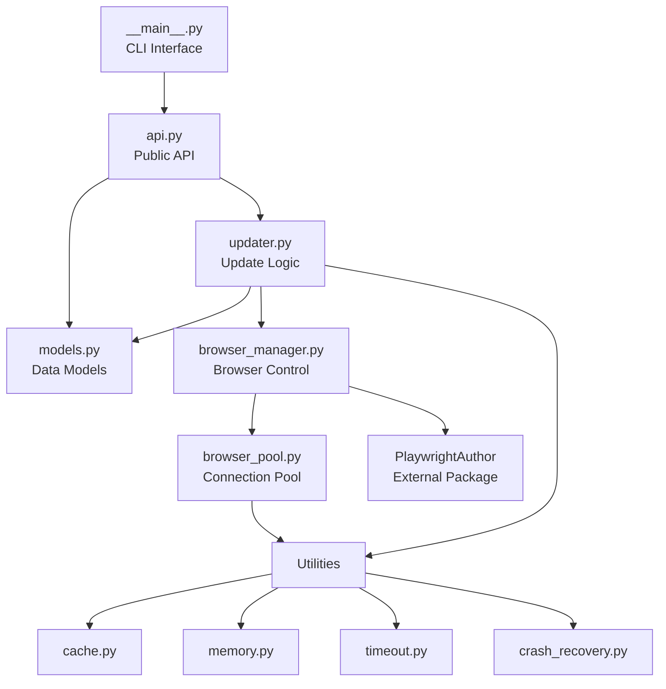

# this_file: ARCHITECTURE.md

# Virginia Clemm Poe - Architecture Guide

This document describes the architecture of Virginia Clemm Poe, including module relationships, data flow, integration patterns, and design decisions.

## Table of Contents

1. [Architecture Overview](#architecture-overview)
2. [Module Relationships](#module-relationships)
3. [Data Flow](#data-flow)
4. [PlaywrightAuthor Integration](#playwrightauthor-integration)
5. [Extension Points](#extension-points)
6. [Architectural Decisions](#architectural-decisions)
7. [Performance Architecture](#performance-architecture)
8. [Future Architecture](#future-architecture)

## Architecture Overview

Virginia Clemm Poe follows a layered architecture pattern optimized for maintainability, performance, and extensibility.

```
┌─────────────────────────────────────────────────────────┐
│                    CLI Interface                        │
│                   (__main__.py)                         │
├─────────────────────────────────────────────────────────┤
│                    Public API                           │
│                    (api.py)                             │
├─────────────────────────────────────────────────────────┤
│                 Core Business Logic                     │
│              (updater.py, models.py)                    │
├─────────────────────────────────────────────────────────┤
│              Infrastructure Layer                       │
│    (browser_manager.py, browser_pool.py)               │
├─────────────────────────────────────────────────────────┤
│                 Utilities Layer                         │
│  (cache.py, memory.py, timeout.py, crash_recovery.py)  │
├─────────────────────────────────────────────────────────┤
│              External Dependencies                      │
│        (PlaywrightAuthor, httpx, pydantic)              │
└─────────────────────────────────────────────────────────┘
```

### Key Principles

1. **Separation of Concerns**: Each module has a single, well-defined responsibility
2. **Dependency Inversion**: High-level modules don't depend on low-level details
3. **Interface Segregation**: Minimal, focused interfaces between layers
4. **Open/Closed**: Extensible for new features without modifying existing code

## Module Relationships

### Core Modules



### Module Responsibilities

#### `__main__.py` - CLI Interface
- User interaction and command parsing
- Argument validation and help text
- Output formatting with Rich
- Delegates all logic to other modules

#### `api.py` - Public API
- Primary programmatic interface
- Data access and search functionality
- Caching layer for performance
- Type-safe return values

#### `models.py` - Data Models
- Pydantic models for type safety
- Data validation and serialization
- Business logic methods (e.g., `get_primary_cost()`)
- Schema versioning support

#### `updater.py` - Update Logic
- Orchestrates data fetching from Poe API
- Manages web scraping operations
- Handles incremental updates
- Error recovery and retry logic

#### `browser_manager.py` - Browser Control
- Abstracts browser automation details
- Integrates with PlaywrightAuthor
- Manages CDP connections
- Provides async context manager interface

#### `browser_pool.py` - Connection Pooling
- Maintains pool of browser connections
- Health checks and connection validation
- Resource lifecycle management
- Performance optimization

### Utility Modules

#### `utils/cache.py` - Caching System
- TTL-based cache with LRU eviction
- Multiple cache instances (API, Scraping, Global)
- Statistics tracking for monitoring
- Decorator-based integration

#### `utils/memory.py` - Memory Management
- Real-time memory monitoring
- Automatic garbage collection triggers
- Operation-scoped memory tracking
- Configurable thresholds and alerts

#### `utils/timeout.py` - Timeout Handling
- Graceful timeout with cleanup
- Retry logic with exponential backoff
- Context managers and decorators
- Configurable timeout values

#### `utils/crash_recovery.py` - Crash Recovery
- Browser crash detection (7 types)
- Exponential backoff retry strategy
- Crash history and statistics
- Automatic recovery mechanisms

## Data Flow

### Model Update Flow

```
User Request → CLI → Updater
                      ↓
              Fetch from Poe API ← [Cache Check]
                      ↓
              Parse API Response
                      ↓
              For Each Model:
                      ↓
              Browser Pool → Get Connection
                      ↓
              Navigate to Model Page
                      ↓
              Scrape Pricing/Bot Info ← [Cache Check]
                      ↓
              Update Model Data
                      ↓
              Save to JSON File → [Cache Invalidate]
```

### Data Query Flow

```
User Query → CLI/API
              ↓
        Load Models ← [In-Memory Cache]
              ↓
        Apply Filters
              ↓
        Sort Results
              ↓
        Return Data
```

### Caching Strategy

1. **API Cache** (10 min TTL)
   - Poe API responses
   - Reduces API calls during updates

2. **Scraping Cache** (1 hour TTL)
   - Web scraping results
   - Prevents redundant browser operations

3. **Global Cache** (5 min TTL)
   - Frequently accessed computed values
   - Cross-request optimization

## PlaywrightAuthor Integration

### Integration Architecture

```python
# browser_manager.py simplified view
class BrowserManager:
    @staticmethod
    async def setup_chrome() -> bool:
        """Delegates to PlaywrightAuthor for setup."""
        browser_path, data_dir = ensure_browser(verbose=True)
        return True
    
    async def launch(self) -> Browser:
        """Uses PlaywrightAuthor paths, manages CDP connection."""
        browser_path, data_dir = ensure_browser()
        
        # Direct Playwright CDP connection
        browser = await self.playwright.chromium.connect_over_cdp(
            f"http://localhost:{self.debug_port}"
        )
        return browser
```

### Key Integration Points

1. **Browser Installation**
   - `playwrightauthor.browser_manager.ensure_browser()`
   - Handles Chrome detection and installation
   - Cross-platform path management

2. **Configuration**
   - Uses PlaywrightAuthor's data directory
   - Consistent browser flags and settings
   - Shared cache location

3. **Error Handling**
   - Leverages PlaywrightAuthor's robust error handling
   - Falls back gracefully on browser issues
   - Consistent error messages

### Benefits of External Dependency

1. **Reduced Maintenance**: ~500 lines of browser code eliminated
2. **Battle-Tested**: Used across multiple projects
3. **Regular Updates**: Browser compatibility maintained externally
4. **Focused Development**: Can focus on core Poe functionality

## Extension Points

### 1. Custom Scrapers

```python
# Future: Pluggable scraper interface
class ScraperPlugin(Protocol):
    async def scrape(self, page: Page, model_id: str) -> dict:
        """Extract custom data from model page."""
        ...

# Register custom scraper
updater.register_scraper("custom_field", CustomScraperPlugin())
```

### 2. Data Processors

```python
# Future: Post-processing pipeline
class DataProcessor(Protocol):
    def process(self, model: PoeModel) -> PoeModel:
        """Transform or enrich model data."""
        ...

# Add to processing pipeline
api.add_processor(PricingNormalizer())
api.add_processor(CurrencyConverter())
```

### 3. Export Formats

```python
# Future: Multiple export formats
class Exporter(Protocol):
    def export(self, models: list[PoeModel], output: Path) -> None:
        """Export models to custom format."""
        ...

# Register exporters
exporters.register("csv", CSVExporter())
exporters.register("excel", ExcelExporter())
exporters.register("parquet", ParquetExporter())
```

### 4. Storage Backends

```python
# Future: Pluggable storage
class StorageBackend(Protocol):
    async def load(self) -> ModelCollection:
        """Load model collection."""
        ...
    
    async def save(self, collection: ModelCollection) -> None:
        """Save model collection."""
        ...

# Use alternative storage
storage = S3StorageBackend(bucket="poe-models")
api.set_storage(storage)
```

### 5. Custom Filters

```python
# Future: Advanced filtering
class ModelFilter(Protocol):
    def matches(self, model: PoeModel) -> bool:
        """Check if model matches criteria."""
        ...

# Complex filtering
filters = [
    PriceRangeFilter(min=10, max=100),
    ModalityFilter(input=["text", "image"]),
    OwnerFilter(owners=["openai", "anthropic"])
]
results = api.search_models_advanced(filters)
```

## Architectural Decisions

### 1. Browser Automation Approach

**Decision**: Use external PlaywrightAuthor package instead of implementing browser management

**Rationale**:
- Reduces maintenance burden significantly
- Leverages battle-tested browser automation
- Allows focus on core business logic
- Easier cross-platform support

**Trade-offs**:
- Additional dependency
- Less control over browser behavior
- Must follow PlaywrightAuthor conventions

### 2. Data Storage Format

**Decision**: Single JSON file for all model data

**Rationale**:
- Simple and portable
- Human-readable for debugging
- Fast loading with in-memory caching
- No database dependencies

**Trade-offs**:
- Limited concurrent write safety
- Full file rewrite on updates
- Memory usage scales with data size

### 3. Async Architecture

**Decision**: Async/await throughout for I/O operations

**Rationale**:
- Efficient browser automation
- Concurrent API requests
- Better resource utilization
- Modern Python best practices

**Trade-offs**:
- More complex error handling
- Requires understanding of asyncio
- Some libraries may not support async

### 4. Type System Usage

**Decision**: Comprehensive type hints with Pydantic models

**Rationale**:
- Runtime validation for external data
- Excellent IDE support
- Self-documenting code
- Reduces bugs significantly

**Trade-offs**:
- Verbose type definitions
- Learning curve for contributors
- Pydantic dependency

### 5. Caching Strategy

**Decision**: Multi-level caching with different TTLs

**Rationale**:
- Dramatic performance improvement
- Reduces API rate limit pressure
- Better user experience
- Configurable for different use cases

**Trade-offs**:
- Memory usage for cache storage
- Cache invalidation complexity
- Potential stale data issues

## Performance Architecture

### Connection Pooling

```python
# Browser connection reuse
pool = BrowserPool(max_connections=3)

# Health checks ensure reliability
async def is_connection_healthy(browser):
    return await browser.is_connected()

# Automatic cleanup of stale connections
```

### Memory Management

```python
# Proactive memory monitoring
monitor = MemoryMonitor(
    warning_threshold_mb=150,
    critical_threshold_mb=200
)

# Automatic garbage collection
if monitor.should_cleanup():
    gc.collect()
```

### Timeout Protection

```python
# No operations hang indefinitely
@timeout_handler(timeout=30.0)
async def scrape_with_timeout():
    # Operation protected from hanging
    pass
```

### Crash Recovery

```python
# Automatic retry with exponential backoff
@crash_recovery_handler(max_retries=5)
async def resilient_scrape():
    # Recovers from browser crashes
    pass
```

## Future Architecture

### Planned Enhancements

1. **Plugin System**
   - Dynamic loading of extensions
   - Hook system for customization
   - Third-party integrations

2. **Distributed Updates**
   - Parallel scraping across machines
   - Work queue for large updates
   - Progress synchronization

3. **Real-time Updates**
   - WebSocket integration for live data
   - Incremental updates via webhooks
   - Change notification system

4. **Advanced Analytics**
   - Historical pricing trends
   - Model popularity tracking
   - Usage pattern analysis

### Migration Path

1. **Phase 1**: Current monolithic architecture
2. **Phase 2**: Extract interfaces for extension points
3. **Phase 3**: Implement plugin loading system
4. **Phase 4**: Separate core from extensions
5. **Phase 5**: Microservices for scalability

## Design Patterns Used

1. **Repository Pattern**: `api.py` acts as data repository
2. **Factory Pattern**: Browser connection creation
3. **Observer Pattern**: Cache invalidation notifications
4. **Decorator Pattern**: Timeout and retry handlers
5. **Context Manager**: Resource lifecycle management
6. **Strategy Pattern**: Different caching strategies
7. **Template Method**: Update workflow in `updater.py`

## Conclusion

Virginia Clemm Poe's architecture prioritizes:
- **Simplicity**: Easy to understand and modify
- **Performance**: Optimized for speed and efficiency
- **Reliability**: Comprehensive error handling
- **Extensibility**: Clear extension points
- **Maintainability**: Clean separation of concerns

The architecture is designed to evolve with user needs while maintaining backward compatibility and high performance.