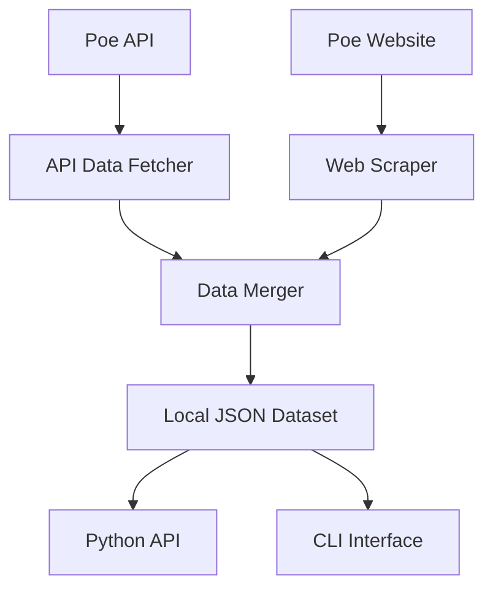

# Chapter 1: Introduction and Overview

## What is Virginia Clemm Poe?

Virginia Clemm Poe is a specialized Python package designed to bridge the gap between the official Poe.com API and the rich metadata available on the Poe website. While the Poe API provides basic model information, it lacks crucial details like pricing data, detailed descriptions, and creator information that are only available through the web interface.

This package solves that problem by combining API data with intelligent web scraping to create a comprehensive, locally-cached dataset of all Poe.com models with their complete metadata.

## Why This Package Exists

### The Problem

The Poe.com platform hosts hundreds of AI models from various providers, each with different capabilities, pricing structures, and use cases. While Poe provides an API to access these models programmatically, the API response lacks several key pieces of information:

- **Detailed Pricing Information**: Cost per message, input pricing, cache discounts
- **Rich Metadata**: Creator information, detailed descriptions, model capabilities
- **Real-time Availability**: Which models are currently active and accessible

### The Solution

Virginia Clemm Poe addresses these limitations by:

1. **Fetching Complete API Data**: Starting with the official Poe API to get the base model list
2. **Intelligent Web Scraping**: Using Playwright to navigate to each model's page and extract missing information
3. **Data Enrichment**: Combining API and scraped data into comprehensive model records
4. **Local Caching**: Storing the enriched dataset locally for fast, offline access
5. **Easy Access**: Providing both Python API and CLI interfaces for different use cases

## Core Architecture

### Data Flow

### Key Components

1. **API Client** (`api.py`): Handles communication with the Poe API
2. **Web Scraper** (`updater.py`, `browser_manager.py`): Manages browser automation and data extraction
3. **Data Models** (`models.py`): Pydantic models for type safety and validation
4. **Local Storage**: JSON-based dataset with version control
5. **User Interfaces**: Python API and CLI for different access patterns

## Package Philosophy

### Design Principles

- **Reliability First**: Robust error handling and graceful degradation
- **Type Safety**: Full Pydantic models with comprehensive validation
- **Performance**: Local caching minimizes network requests
- **Transparency**: Clear logging and debugging capabilities
- **Maintainability**: Clean architecture with separation of concerns

### Data Integrity

The package prioritizes data accuracy and freshness:

- **Incremental Updates**: Only scrape models that need updates
- **Validation**: Pydantic models ensure data consistency
- **Backup and Recovery**: Automatic backup of existing data before updates
- **Version Tracking**: Timestamps for data freshness monitoring

## Use Cases

### For Developers

- **Model Discovery**: Find the right AI model for your specific needs
- **Cost Analysis**: Compare pricing across different models and providers
- **Integration Planning**: Understand model capabilities before implementation
- **Monitoring**: Track model availability and pricing changes

### For Researchers

- **Market Analysis**: Study the AI model landscape and pricing trends
- **Capability Mapping**: Understand the distribution of AI capabilities
- **Provider Comparison**: Analyze different AI providers' offerings

### For Business Users

- **Cost Optimization**: Find the most cost-effective models for your use cases
- **Vendor Evaluation**: Compare AI providers and their model portfolios
- **Budget Planning**: Understand pricing structures for budget allocation

## What's Next

In the following chapters, you'll learn how to:

- Install and configure the package
- Use the Python API for programmatic access
- Leverage the CLI for data management and querying
- Understand the data structures and models
- Configure advanced features and troubleshoot issues

## Package Naming

The package is named after **Virginia Clemm Poe** (1822-1847), the wife and cousin of Edgar Allan Poe. Just as Virginia was a faithful companion to the great poet, this package serves as a faithful companion to the Poe platform, enriching and enhancing the core functionality with additional valuable information.

The choice reflects the package's role as a supportive tool that doesn't replace the original Poe API but rather complements and enhances it, much like how Virginia supported and inspired Edgar Allan Poe's literary work.